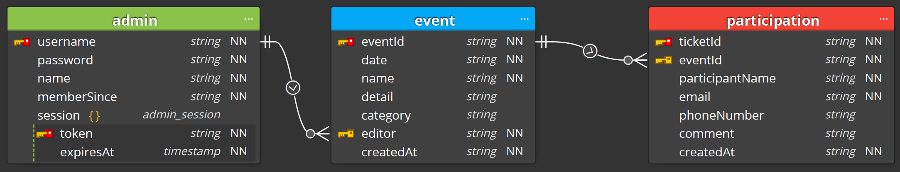

# BGM Event Calendar API

[](https://github.com/google/gts)


부산개발자모임 이벤트 캘린더의 백앤드 API를 위한 저장소입니다.

지원하는 API 목록과 기능은 [API 문서](https://busandevelopers.github.io/BGM-Event-Calendar-API-Documentation/)를 참고해 주십시오.


## Scripts

아래는 테스트, lint, 빌드, 실행을 위한 npm/yarn 스크립트 목록입니다.

1. `lint`: 코드 검사 실행
2. `lint:fix`: 코드 검사 후 자동 수정 시도
3. `build`: 타입스크립트 코드 컴파일 (destination: `dist` 디렉터리)
4. `clean`: 컴파일 된 코드 삭제
5. `start`: 코드 실행 (DB_KEY 환경변수 필요)
6. `test`: 코드 테스트


## Dependencies/Environment

`Ubuntu 20.04.3 LTS`의 `Node v16.13.1` 환경에서 개발 및 테스트되었습니다.

타입스크립트 개발 환경을 쉽게 구축하기 위해 [gts](https://github.com/google/gts) 라이브러리가 사용되었습니다..
`gts`에서 정의된 코드 스타일 규칙을 바탕으로, 더 엄격한 스타일 준수를 위해 [`.eslintrc.json` 파일](https://github.com/BusanDevelopers/BGM-Event-Calendar-API/blob/main/.eslintrc.json)에 정의한 대로 코드 스타일 규칙을 수정하였습니다.

데이터베이스는 [Azure Cosmos DB](https://docs.microsoft.com/en-us/azure/cosmos-db/introduction) (Core(SQL) API)를 사용합니다.  
NoSQL 데이터베이스이므로 별도의 스키마는 없으나, 아래의 Data Diagram에 맞추어 자료가 저장될 수 있도록 합니다.

Data Diagram


<details>
  <summary>각 컬랙션을 만들때 사용된 설정값과 인덱스 설정을 확인하려면 클릭해 주십시오.</summary>
 

[comment]: <> (  `admin` 테이블을 만들기 위한 SQL 쿼리)

[comment]: <> (  ``` SQL)

[comment]: <> (  CREATE TABLE admin &#40;)

[comment]: <> (    username VARCHAR&#40;12&#41; NOT NULL PRIMARY KEY,)

[comment]: <> (    password CHAR&#40;88&#41; NOT NULL,)

[comment]: <> (    name VARCHAR&#40;255&#41; NOT NULL,)

[comment]: <> (    membersince TIMESTAMP NOT NULL DEFAULT CURRENT_TIMESTAMP)

[comment]: <> (  &#41; CHARSET=utf8mb4 COLLATE=utf8mb4_general_ci;)

[comment]: <> (  ```)

[comment]: <> (  `admin_session` 테이블을 만들기 위한 SQL 쿼리)

[comment]: <> (  ``` SQL)

[comment]: <> (  CREATE TABLE admin_session &#40;)

[comment]: <> (    username VARCHAR&#40;12&#41; NOT NULL UNIQUE,)

[comment]: <> (    FOREIGN KEY &#40;username&#41; REFERENCES admin&#40;username&#41; ON DELETE CASCADE ON UPDATE CASCADE,)

[comment]: <> (    INDEX index_username&#40;username&#41;,)

[comment]: <> (    token VARCHAR&#40;255&#41; NOT NULL PRIMARY KEY,)

[comment]: <> (    expires TIMESTAMP NOT NULL DEFAULT CURRENT_TIMESTAMP,)

[comment]: <> (  &#41; CHARSET=utf8mb4 COLLATE=utf8mb4_general_ci;)

[comment]: <> (  ```)

[comment]: <> (  `event` 테이블을 만들기 위한 SQL 쿼리)

[comment]: <> (  ``` SQL)

[comment]: <> (  CREATE TABLE event &#40;)

[comment]: <> (    id INT&#40;11&#41; NOT NULL AUTO_INCREMENT PRIMARY KEY,)

[comment]: <> (    date TIMESTAMP NOT NULL DEFAULT CURRENT_TIMESTAMP,)

[comment]: <> (    INDEX index_date&#40;date&#41;,)

[comment]: <> (    name VARCHAR&#40;255&#41; NOT NULL,)

[comment]: <> (    detail MEDIUMTEXT NULL DEFAULT NULL,)

[comment]: <> (    category VARCHAR&#40;255&#41; NULL DEFAULT NULL,)

[comment]: <> (    editor VARCHAR&#40;12&#41; NOT NULL,)

[comment]: <> (    FOREIGN KEY &#40;editor&#41; REFERENCES admin&#40;username&#41; ON DELETE CASCADE ON UPDATE CASCADE)

[comment]: <> (  &#41; CHARSET=utf8mb4 COLLATE=utf8mb4_general_ci;)

[comment]: <> (  ```)

[comment]: <> (  `participation` 테이블을 만들기 위한 SQL 쿼리)

[comment]: <> (  ``` SQL)

[comment]: <> (  CREATE TABLE participation &#40;)

[comment]: <> (    id INT&#40;11&#41; NOT NULL AUTO_INCREMENT PRIMARY KEY,)

[comment]: <> (    event_id INT&#40;11&#41; NOT NULL,)

[comment]: <> (    FOREIGN KEY &#40;event_id&#41; REFERENCES event&#40;id&#41; ON DELETE CASCADE ON UPDATE CASCADE,)

[comment]: <> (    INDEX index_event_id&#40;event_id&#41;,)

[comment]: <> (    date TIMESTAMP NOT NULL DEFAULT CURRENT_TIMESTAMP,)

[comment]: <> (    participant_name VARCHAR&#40;255&#41; NOT NULL,)

[comment]: <> (    INDEX index_participant_name&#40;participant_name&#41;,)

[comment]: <> (    phone_number VARCHAR&#40;20&#41; NULL DEFAULT NULL,)

[comment]: <> (    email VARCHAR&#40;255&#41; NOT NULL,)

[comment]: <> (    INDEX index_email&#40;email&#41;,)

[comment]: <> (    comment TEXT NULL DEFAULT NULL)

[comment]: <> (  &#41; CHARSET=utf8mb4 COLLATE=utf8mb4_general_ci;)

[comment]: <> (  ```)
</details>

[Express](https://expressjs.com/)는 node.js를 위한 웹 프레임워크입니다.
편리하고 빠른 API의 개발과 유지를 위해 이 프로젝트는 express 프레임워크를 사용합니다.

런타임에서의 타입 체크를 위해 [ajv](https://ajv.js.org/)가 사용됩니다.
