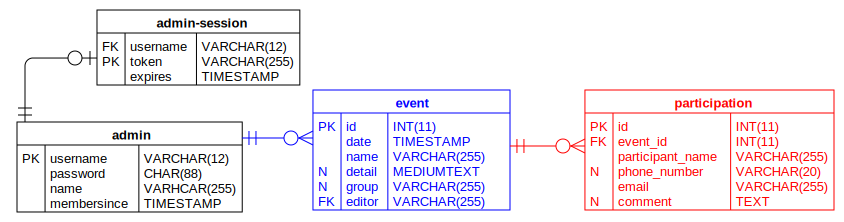

# BGM Event Calendar API

부산개발자모임 이벤트 캘린더의 백앤드 API를 위한 저장소입니다.

지원하는 API 목록과 기능은 [API 문서](https://busandevelopers.github.io/BGM-Event-Calendar-API-Documentation/)를 참고해 주십시오.

## Scripts

아래는 테스트, lint, 빌드, 실행을 위한 npm/yarn 스크립트 목록입니다.

1. `lint`: 코드 검사 실행
2. `lint:fix`: 코드 검사 후 자동 수정 시도
3. `build`: 타입스크립트 코드 컴파일 (destination: `dist` 디렉터리)
4. `clean`: 컴파일 된 코드 삭제
5. `start`: 코드 실행
6. `test`: 코드 테스트

## Dependencies/Environment

`Ubuntu 20.04.3 LTS`의 `Node v14.17.2` 환경에서 개발 및 테스트되었습니다.

타입스크립트 개발 환경을 쉽게 구축하기 위해 [gts](https://github.com/google/gts) 라이브러리가 사용되었습니다..
`gts`에서 정의된 코드 스타일 규칙을 바탕으로, 더 엄격한 스타일 준수를 위해 [`.eslintrc.json` 파일](https://github.com/BusanDevelopers/BGM-Event-Calendar-API/blob/main/.eslintrc.json)에 정의한 대로 코드 스타일 규칙을 수정하였습니다.

데이터베이스는 MySQL과 호환되는 [MariaDB](https://mariadb.org/)를 사용합니다.

Data Diagram

  
테이블을 만들기 위해 사용된 SQL Query를 보려면 클릭해 주십시오.

  TO BE UPDATED

[Express](https://expressjs.com/)는 node.js를 위한 웹 프레임워크입니다.
편리하고 빠른 API의 개발과 유지를 위해 이 프로젝트는 express 프레임워크를 사용합니다.

런타임에서의 타입 체크를 위해 [ajv](https://ajv.js.org/)가 사용됩니다.