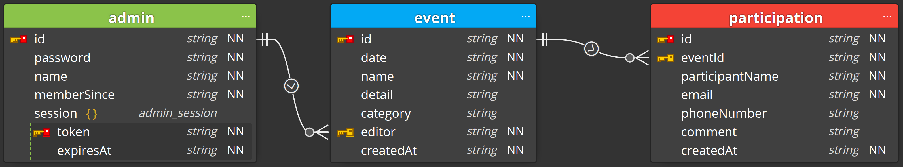

# BGM Event Calendar API

[](https://github.com/google/gts)


부산개발자모임 이벤트 캘린더의 백앤드 API를 위한 저장소입니다.

지원하는 API 목록과 기능은 [API 문서](https://busandevelopers.github.io/BGM-Event-Calendar-API-Documentation/)를 참고해 주십시오.


## Scripts

아래는 테스트, lint, 빌드, 실행을 위한 npm/yarn 스크립트 목록입니다.

1. `lint`: 코드 검사 실행
2. `lint:fix`: 코드 검사 후 자동 수정 시도
3. `build`: 타입스크립트 코드 컴파일 (destination: `dist` 디렉터리)
4. `clean`: 컴파일 된 코드 삭제
5. `start`: 코드 실행 (DB_ENDPOINT, DB_KEY, DB_ID 환경변수 필요)
6. `test`: 코드 테스트
7. `newAdmin`: 새 관리자 계정 등록 (3개의 CLA 필요 - username, password, 사용자이름)
8. `deleteAdmin`: 관리자 계정 삭제 (1개의 CLA 필요 - username) 

테스트 시, Azure Cosmos DB 환경을 구현해주는 에뮬레이터를 사용합니다.
에뮬레이터의 설치 및 사용에 관한 자세한 사항은 [이 링크](https://docs.microsoft.com/en-us/azure/cosmos-db/local-emulator?tabs=ssl-netstd21) 를 참고해주세요.  
리눅스 도커 이미지도 제공되나, 심각한 성능상의 문제로 윈도우에서 에뮬레이터를 실행시키는 것을 권장합니다.
이 경우, 외부 접근을 위한 별도의 설정이 필요합니다.
위에서 제공된 링크를 참고하시기 바랍니다.

현재, GitHub Action의 Windows Worker의 경우 Service Container 실행에 제약이 있습니다.
이에 따라, Azure Cosmos DB Emulator가 GitHub Action Worker에서 정상적으로 실행되지 않습니다.
이에, 현재 자동 테스트 기능은 비활성화되어있으며, 모든 기능에 대해서 PR 및 머지 전 로컬 환경에서의 테스트 및 코드 검토가 필요합니다.


## Dependencies/Environment

`Ubuntu 20.04.3 LTS`의 `Node v16.13.1` 환경에서 개발 및 테스트되었습니다.

타입스크립트 개발 환경을 쉽게 구축하기 위해 [gts](https://github.com/google/gts) 라이브러리가 사용되었습니다..
`gts`에서 정의된 코드 스타일 규칙을 바탕으로, 더 엄격한 스타일 준수를 위해 [`.eslintrc.json` 파일](https://github.com/BusanDevelopers/BGM-Event-Calendar-API/blob/main/.eslintrc.json)에 정의한 대로 코드 스타일 규칙을 수정하였습니다.

데이터베이스는 [Azure Cosmos DB](https://docs.microsoft.com/en-us/azure/cosmos-db/introduction) (Core(SQL) API)를 사용합니다.  
NoSQL 데이터베이스이므로 별도의 스키마는 없으나, 아래의 Data Diagram에 맞추어 자료가 저장될 수 있도록 합니다.

Data Diagram


<details>
  <summary>각 컬랙션을 만들때 사용된 설정값과 인덱스 설정을 확인하려면 클릭해 주십시오.</summary>

  `admin` 컬랙션의 속성
  ``` JSON
  {
    id: 'admin',
    indexingPolicy: {
      indexingMode: 'consistent',
      automatic: true,
      includedPaths: [{path: '/session/token/?'}],
      excludedPaths: [{path: '/*'}, {path: '/"_etag"/?'}],
    },
  }
  ```

  `event` 컬랙션의 속성
  ``` JSON
  {
    id: 'event',
    indexingPolicy: {
      indexingMode: 'consistent',
      automatic: true,
      includedPaths: [{path: '/date/?'}],
      excludedPaths: [{path: '/*'}, {path: '/"_etag"/?'}],
    },
  }
  ```

  `participation` 컬랙션의 속성
  ``` JSON
  {
    id: 'participation',
    partitionKey: {paths: ['/eventId']},
    uniqueKeyPolicy: {
      uniqueKeys: [{paths: ['/eventId', '/participantName', '/email']}],
    },
    indexingPolicy: {
      indexingMode: 'consistent',
      automatic: true,
      includedPaths: [
        {path: '/eventId/?'},
        {path: '/participantName/?'},
        {path: '/email/?'},
      ],
      excludedPaths: [{path: '/*'}, {path: '/"_etag"/?'}],
    },
  }
  ```
</details>

[Express](https://expressjs.com/)는 node.js를 위한 웹 프레임워크입니다.
편리하고 빠른 API의 개발과 유지를 위해 이 프로젝트는 express 프레임워크를 사용합니다.

런타임에서의 타입 체크를 위해 [ajv](https://ajv.js.org/)가 사용됩니다.
